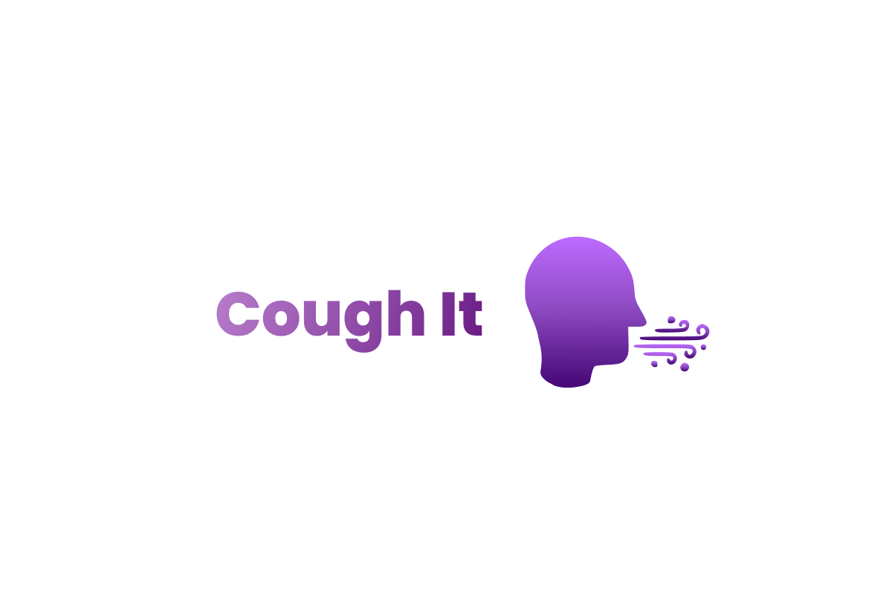
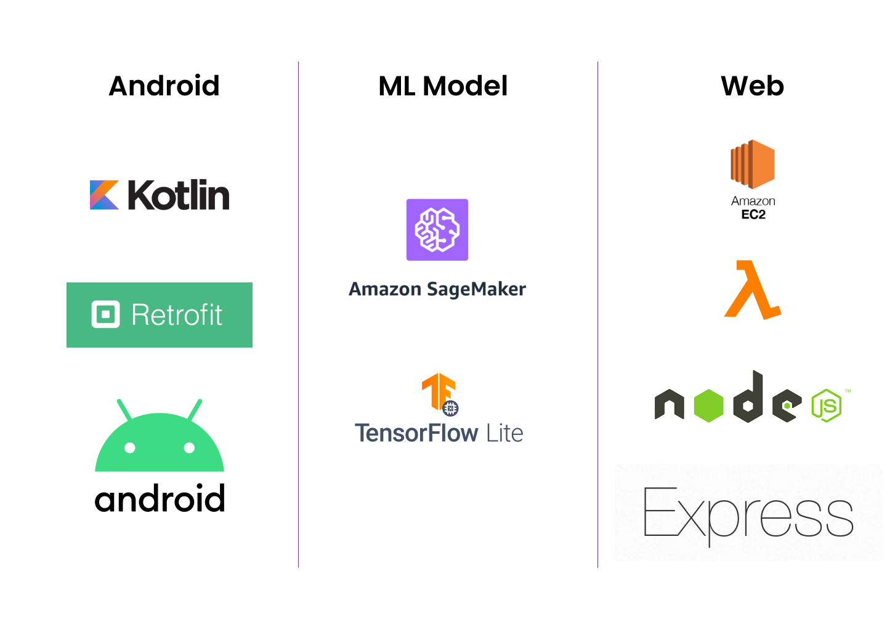
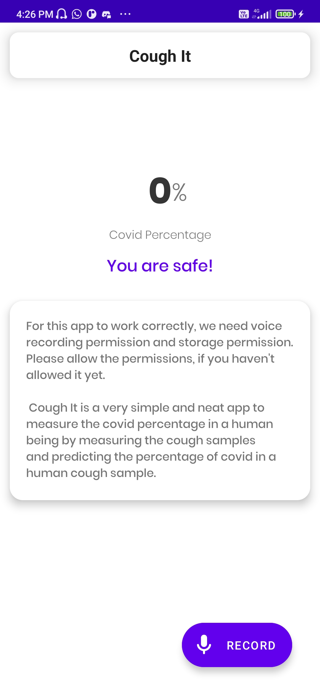
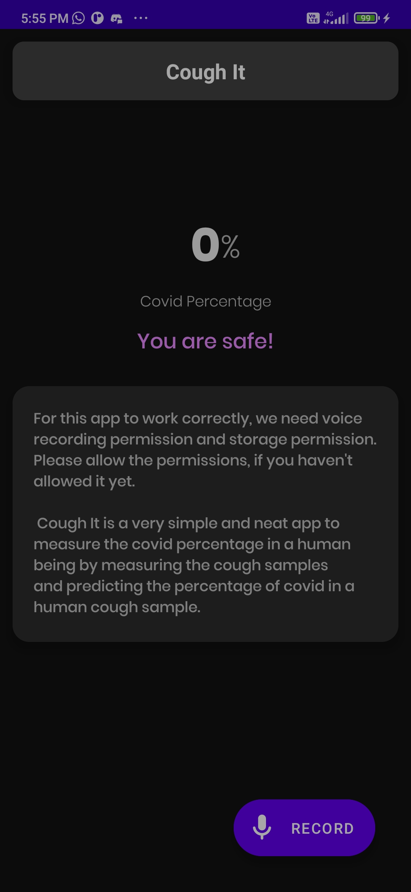
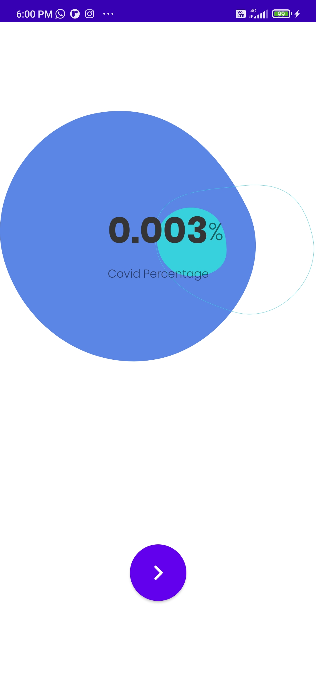
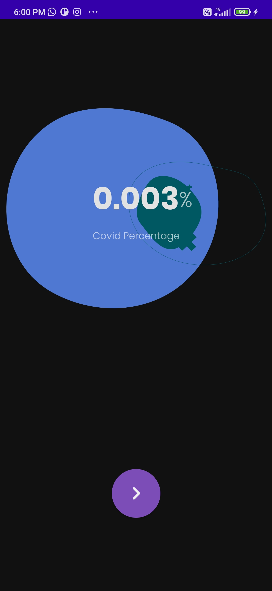

# **Cough It**
#### COVID-19 Diagnosis at Ease

  

## Inspiration
As the pandemic has nearly crippled all the nations and still in many countries, people are in lockdown, there are many innovations in these two years that came up in order to find an effective way of tackling the issues of COVID-19. Out of all the problems, detecting the COVID-19 strain has been the hardest so far as it is always mutating due to rapid infections. 

Just like many others, we started to work on an idea to detect COVID-19 with the help of cough samples generated by the patients. What makes this app useful is its simplicity and scalability as users can record a cough sample and just wait for the results to load and it can give an accurate result of where one have the chances of having COVID-19 or not. 

## Objective
The current COVID-19 diagnostic procedures are resource-intensive, expensive and slow. Therefore they are lacking scalability and retarding the efficiency of mass-testing during the pandemic. In many cases even the physical distancing protocol has to be violated in order to collect subject's samples. Disposing off biohazardous samples after diagnosis is also not eco-friendly.

To tackle this, we aim to develop a mobile-based application COVID-19 diagnostic system that:

* provides a fast, safe and user-friendly to detect COVID-19 infection just by providing their cough audio samples
* is accurate enough so that can be scaled-up to cater a large population, thus eliminating dependency on resource-heavy labs
* makes frequent testing and result tracking efficient, inexpensive and free of human error, thus eliminating economical and logistic barriers, and reducing the wokload of medical professionals

Our [proposed CNN](https://dicova2021.github.io/docs/reports/team_Brogrammers_DiCOVA_2021_Challenge_System_Report.pdf) architecture also secured Rank 1 at [DiCOVA](https://dicova2021.github.io/) Challenge 2021, held by IISc Bangalore researchers, amongst 85 teams spread across the globe. With only being trained on small dataset of 1,040 cough samples our model reported:

Accuracy: 94.61%
Sensitivity: 80% (20% false negative rate)
AUC of ROC curve: 87.07% (on blind test set)

## What it does
The working of **Cough It** is simple. User can simply install the app and tap to open it. Then, the app will ask for user permission for external storage and microphone. The user can then just tap the record button and it will take the user to a countdown timer like interface. Playing the play button will simply start recording a 7-seconds clip of cough sample of the user and upon completion it will navigate to the result screen for prediction the chances of the user having COVID-19

## How we built it
Our project is divided into three different modules --> 
#### **ML Model** 
Our machine learning model ( CNN architecture ) will be trained and deployed using the Sagemaker API which is apart of AWS to predict positive or negative infection from the pre-processed audio samples. The training data will also contain noisy and bad quality audio sample, so that it is robust for practical applications. 

#### **Android App**
At first, we prepared the wireframe for the app and decided the architecture of the app which we will be using for our case. Then, we worked from the backend part first, so that we can structure our app in proper android MVVM architecture. We constructed all the models, Retrofit Instances and other necessary modules for code separation. 

The android app is built in Kotlin and is following MVVM architecture for scalability. The app uses Media Recorder class to record the cough samples of the patient and store them locally. The saved file is then accessed by the android app and converted to byte array and Base64 encoded which is then sent to the web backend through Retrofit. 

#### **Web Backend**
The web backend is actually a Node.js application which is deployed on EC2 instance in AWS. We choose this type of architecture for our backend service because we wanted a more reliable connection between our ML model and our Node.js application. 

At first, we created a backend server using Node.js and Express.js and deployed the Node.js server in AWS EC2 instance. The server then receives the audio file in Base64 encoded form from the android client through a POST request API call. After that, the file is getting converted to .wav file through a module in terminal through command. After successfully, generating the .wav file, we put that .wav file as argument in the pre-processor which is a python script. Then we call the AWS Sagemaker API to get the predictions and the Node.js application then sends the predictions back to the android counterpart to the endpoint. 

## Tech Stack

  

## Screenshots for the Android App

 

   &nbsp; &nbsp;
   &nbsp; &nbsp;
     
   &nbsp; &nbsp;
  &nbsp; &nbsp;
  

